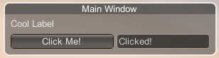

# EasyIMGUI (Unity)
EasyIMGUI in a wrapper for UnityEngine.GUI & UnityEngine.GUILayout in the Unity IMGUI module. It's main focus is for modding and not for usage in Unity, but you could use it in Unity too I guess.🤷


## Example Usage
#### Creating a draggable Window with a Label
```
using EasyIMGUI.Controls.Automatic;

...

// initializing 
Window rootWin = new Window()
{
	Content = { text = "Main Window" },
	Dimensions = new Rect(0,0,300,0),
	Controls = 
	{
		new Label()
		{
			Content = { text = "Cool Label" }
		},
	}
};

...

// put the Draw() method in OnGUI() or MelonEvents.OnGUI.Subscribe()
rootWin.Draw();

```

#### Creating a Button and a TextField

```

SingleButton clickMeBtn = new SingleButton()
{
	Content = { text = "Click Me!" }
};

TextField textField = new TextField()
{
	Value = "Waiting..."
};

```

#### Changing the TextField text on click of the Button

```

clickMeBtn.OnButtonPressed += (object sender, EventArgs e) => 
{
	textField.Value = "Clicked!"
};

```

#### Adding the button and textfield to the Window

```

Window rootWin = new Window()
{
	Content = { text = "Main Window" },
	Dimensions = new Rect(0,0,300,0),
	Controls = 
	{
		new Label()
		{
			Content = { text = "Cool Label" }
		},
		new Horizontal() // stacking horizontally
		{
			Controls = 
			{
				clickMeBtn,
				textField
			}
		}
	}
};

```

#### Result


Note: use ` using EasyIMGUI.Controls.Fixed; ` instead if you want to manually define the Dimensions of each control.

## Using MelonLoader Interface
```
WIP
```

## Extending the Controls
WIP
```
WIP
```

## Known Issues
* The Controls.Base.Window control might not work on some il2cpp games due to UnityEngine.GUI.WindowFunction being defined differently. I will update a fix soon.